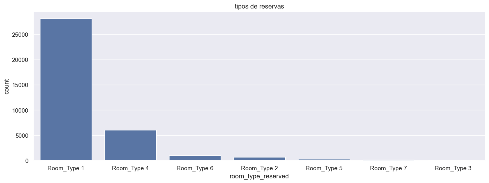
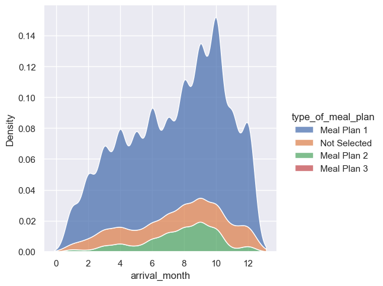
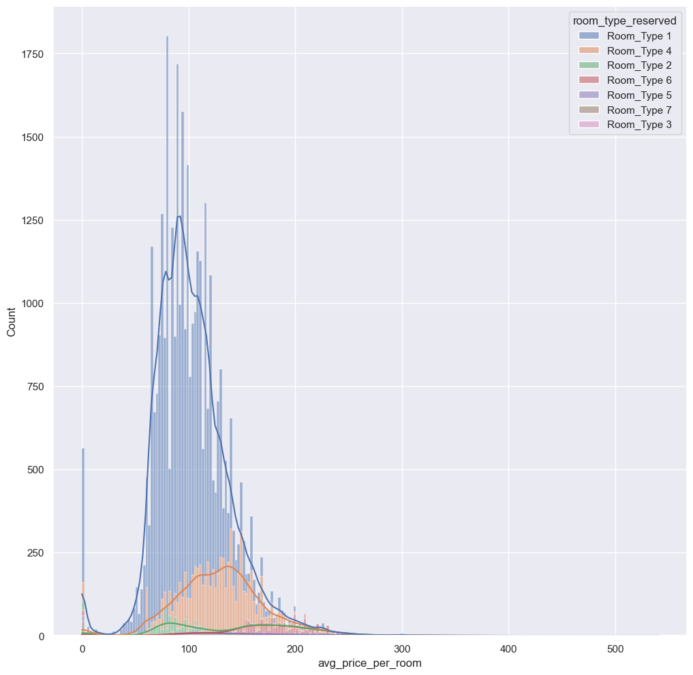

# Estudio del Big Data

El Big Data es el análisis de un volumen grande de datos. Su manejo permite conseguir información valiosa de un conjunto de datos para tomar mejores decisiones.

Se puede aplicar en multiples sectores. Por ejemplo:

|Sector|Dato 1|Dato 2|Dato 3|
|----------------------------------|--------------------------------------|--------------------------------------|---------------------------------|
| **Hostelería**                   | Cuántas reservas hay al día          | Cuánto gasta cada cliente de media  | Qué opinan en redes sociales    |
| **Comercio electrónico**         | Qué productos se venden más          | Cuánta gente compra tras visitar    | Cuánto tiempo pasan en la web   |
| **Servicios públicos (Ayuntamiento)** | Qué problemas se reportan y dónde  | Consumo de agua y luz en edificios  | Uso del transporte público       |
| **Ganadería**                    | Cuánta leche o carne se produce      | Cuántas enfermedades hay en el ganado | Cuánto cuesta la alimentación   |
| **Turismo**                      | Cuántos turistas llegan por temporada | De dónde vienen                     | Cuánto gastan en promedio       |
| **Consumo energético**           | A qué horas se usa más energía       | Qué tipo de energía se consume      | Qué tan eficientes son los edificios |


## Big Data en Hosteleria

A modo de ejemplo del uso del big data se ha utilizado un [dataset](https://www.kaggle.com/datasets/ahsan81/hotel-reservations-classification-dataset?resource=download
) de la plataforma Kaggle.
Los datos que contiene son los siguientes:

| Campo                             | Descripción |
|-----------------------------------|-------------|
| **Booking_ID**                    | ID único de la reserva |
| **no_of_adults**                   | Número de adultos en la reserva |
| **no_of_children**                 | Número de niños en la reserva |
| **no_of_weekend_nights**           | Noches de fin de semana (viernes y sábado) |
| **no_of_week_nights**              | Noches entre semana (domingo a jueves) |
| **type_of_meal_plan**              | Tipo de plan de comidas seleccionado |
| **required_car_parking_space**     | Si se necesita espacio de estacionamiento (Sí/No) |
| **room_type_reserved**             | Tipo de habitación reservada |
| **lead_time**                      | Días entre la reserva y la llegada |
| **arrival_year**                   | Año de llegada |
| **arrival_month**                  | Mes de llegada |
| **arrival_date**                   | Día del mes de llegada |
| **market_segment_type**            | Segmento de mercado del cliente |
| **repeated_guest**                 | Si el huésped ha reservado antes (Sí/No) |
| **no_of_previous_cancellations**   | Número de reservas canceladas previamente |
| **no_of_previous_bookings_not_canceled** | Reservas previas que no se cancelaron |
| **avg_price_per_room**             | Precio promedio por habitación |
| **no_of_special_requests**         | Número de solicitudes especiales del huésped |
| **booking_status**                 | Estado de la reserva (Confirmada/Cancelada) |


Aunque tiene muchos datos, vamos a utilizar unos pocos campos usando python con las librerias Pandas, Matplotlib y Seaborn. Estas librerias nos ofrecen la posibilidad de visualizar los datos con apenas unas líneas de código.


```python
import pandas as pd
import matplotlib.pyplot as plt
import seaborn as sns
```

#### Se genera un dataframe con el archivo csv que contiene el dataset


```python
sns.set_theme()
df = pd.read_csv("Hotel Reservations.csv")
df.head()
```


<div>
<style scoped>
    .dataframe tbody tr th:only-of-type {
        vertical-align: middle;
    }

    .dataframe tbody tr th {
        vertical-align: top;
    }

    .dataframe thead th {
        text-align: right;
    }
</style>
<table border="1" class="dataframe">
  <thead>
    <tr style="text-align: right;">
      <th></th>
      <th>Booking_ID</th>
      <th>no_of_adults</th>
      <th>no_of_children</th>
      <th>no_of_weekend_nights</th>
      <th>no_of_week_nights</th>
      <th>type_of_meal_plan</th>
      <th>required_car_parking_space</th>
      <th>room_type_reserved</th>
      <th>lead_time</th>
      <th>arrival_year</th>
      <th>arrival_month</th>
      <th>arrival_date</th>
      <th>market_segment_type</th>
      <th>repeated_guest</th>
      <th>no_of_previous_cancellations</th>
      <th>no_of_previous_bookings_not_canceled</th>
      <th>avg_price_per_room</th>
      <th>no_of_special_requests</th>
      <th>booking_status</th>
    </tr>
  </thead>
  <tbody>
    <tr>
      <th>0</th>
      <td>INN00001</td>
      <td>2</td>
      <td>0</td>
      <td>1</td>
      <td>2</td>
      <td>Meal Plan 1</td>
      <td>0</td>
      <td>Room_Type 1</td>
      <td>224</td>
      <td>2017</td>
      <td>10</td>
      <td>2</td>
      <td>Offline</td>
      <td>0</td>
      <td>0</td>
      <td>0</td>
      <td>65.00</td>
      <td>0</td>
      <td>Not_Canceled</td>
    </tr>
    <tr>
      <th>1</th>
      <td>INN00002</td>
      <td>2</td>
      <td>0</td>
      <td>2</td>
      <td>3</td>
      <td>Not Selected</td>
      <td>0</td>
      <td>Room_Type 1</td>
      <td>5</td>
      <td>2018</td>
      <td>11</td>
      <td>6</td>
      <td>Online</td>
      <td>0</td>
      <td>0</td>
      <td>0</td>
      <td>106.68</td>
      <td>1</td>
      <td>Not_Canceled</td>
    </tr>
    <tr>
      <th>2</th>
      <td>INN00003</td>
      <td>1</td>
      <td>0</td>
      <td>2</td>
      <td>1</td>
      <td>Meal Plan 1</td>
      <td>0</td>
      <td>Room_Type 1</td>
      <td>1</td>
      <td>2018</td>
      <td>2</td>
      <td>28</td>
      <td>Online</td>
      <td>0</td>
      <td>0</td>
      <td>0</td>
      <td>60.00</td>
      <td>0</td>
      <td>Canceled</td>
    </tr>
    <tr>
      <th>3</th>
      <td>INN00004</td>
      <td>2</td>
      <td>0</td>
      <td>0</td>
      <td>2</td>
      <td>Meal Plan 1</td>
      <td>0</td>
      <td>Room_Type 1</td>
      <td>211</td>
      <td>2018</td>
      <td>5</td>
      <td>20</td>
      <td>Online</td>
      <td>0</td>
      <td>0</td>
      <td>0</td>
      <td>100.00</td>
      <td>0</td>
      <td>Canceled</td>
    </tr>
    <tr>
      <th>4</th>
      <td>INN00005</td>
      <td>2</td>
      <td>0</td>
      <td>1</td>
      <td>1</td>
      <td>Not Selected</td>
      <td>0</td>
      <td>Room_Type 1</td>
      <td>48</td>
      <td>2018</td>
      <td>4</td>
      <td>11</td>
      <td>Online</td>
      <td>0</td>
      <td>0</td>
      <td>0</td>
      <td>94.50</td>
      <td>0</td>
      <td>Canceled</td>
    </tr>
  </tbody>
</table>
</div>


#### Tipos de habitación reservadas


```python
plt.figure(figsize=(15, 5))
sns.countplot(data=df,
              x="room_type_reserved",
              order=df["room_type_reserved"].value_counts().index)

plt.title("tipos de reservas")
plt.show()
```


    

    


#### Medias de las ventas según meses divididas en los planes de almuerzo


```python
plt.figure(figsize=(3, 5))
sns.displot(data=df, x="arrival_month", hue="type_of_meal_plan", multiple="stack", kind="kde",warn_singular=False)
```


    <seaborn.axisgrid.FacetGrid at 0x272520f6ba0>


    <Figure size 300x500 with 0 Axes>


    

    


#### Medias de tipos de habitacion vendidas


```python
plt.figure(figsize=(12, 12))

sns.histplot(data=df, x="avg_price_per_room", hue="room_type_reserved", multiple="stack", kde=True)
```


    <Axes: xlabel='avg_price_per_room', ylabel='Count'>


    

    


#### Un mapa de calor sobre cuando los adultos sin niños van al hotel y que habitación pagan


```python
pivot = df.pivot_table(values='no_of_adults_without_children', index='room_type_reserved', columns='arrival_month', aggfunc='mean')
sns.heatmap(pivot, annot=True, cmap="coolwarm", fmt=".2f", annot_kws={"size": 10})
plt.title("Adultos sin niños por tipo de habitación y mes")
```


    Text(0.5, 1.0, 'Adultos sin niños por tipo de habitacion y mes')


    

    


### Bueno y, ¿qué podemos sacar de esto?

Estas pequeñas gráficas que podemos sacar en poco tiempo ya nos brindan mucha información sobre que habitaciones se venden más, cuando se venden más habitaciones y a que precio se venden más. Esto nos puede llevar a tomar decisiones como en cuando subir o bajar los precios, promover estrategias para ayudar a las ventas de otros tipos de habitaciones o incluso focalizar un tipo de público al que vaya dirigido el hotel en ciertas fechas.

Esto es un simple análisis que conseguimos analizando las gráficas de los datos. Sin embargo, el Big Data tiene bajo sus brazos muchas ramas de la ciencia de los datos donde también entra la estadistica predictiva. Con estos datos se pueden contruir modelos predictivos que ayuden al manejo de fondos y tomas de decisiones.


### Referencias
- [Pandas documentacion oficial](https://pandas.pydata.org/docs/index.html)

- [Seaborn página oficial](https://seaborn.pydata.org/index.html)

- [Kaggle](https://www.kaggle.com)

- [GeekForGeeks sobre seaborn](https://www.geeksforgeeks.org/types-of-seaborn-plots/)

- [CodeToDevs Blog sobre regresión lineal](https://www.codetodevs.com/regresion-lineal-simple-con-python/)


```python

```
